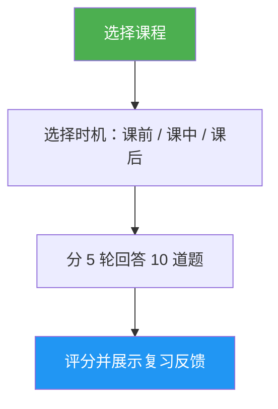

# Lesson Quiz（课程测验）

> 针对某一节 Claude Code 课程的互动测验，10 道题检验你的理解程度，逐题给出反馈，并提供有针对性的复习建议。

## 亮点

- 每节课 10 道题，涵盖概念理解与实操应用
- 覆盖全部 10 节课（01-Slash Commands 到 10-CLI）
- 三种测验时机：预测（pre-test）、学习中检查（progress check）、掌握度验证（mastery verification）
- 逐题反馈，给出正确答案与解释
- 有针对性的复习建议，指向课程的具体章节
- `references/question-bank.md` 中收录全部课程共 100 道题的题库

## 何时使用

| 你可以这样说… | 技能会… |
|---|---|
| "quiz me on hooks" | 针对第 06 课「Hooks」进行一次 10 题测验 |
| "lesson quiz 03" | 检验你对第 03 课「Skills」的掌握情况 |
| "do I understand MCP" | 评估你对第 05 课「MCP」的理解程度 |
| "practice quiz" | 让你先选课程，再进行测验 |

## 工作原理



## 用法

```
/lesson-quiz [lesson-name-or-number]
```

示例：
```
/lesson-quiz hooks
/lesson-quiz 03
/lesson-quiz advanced-features
/lesson-quiz           # （会提示你选择课程）
```

## 输出内容

### 分数报告
- 满分 10 分的总分与等级（精通 / 熟练 / 发展中 / 入门）
- 按题目类别（概念 vs 实操）拆分的表现

### 逐题反馈
针对每道答错的题目：
- 你的作答 vs 正确答案
- 为什么正确答案是对的
- 应重点复习的课程小节

### 结合时机的建议
- **课前（Pre-test）**：确立基线水平，指出学习时应重点关注的部分
- **课中（During）**：明确已掌握的内容和仍需回顾的内容
- **课后（After）**：确认是否已掌握，或指出仍存在的差距

## 资源

| 路径 | 说明 |
|---|---|
| `references/question-bank.md` | 100 道预先写好的题目（每节课 10 道），含答案、解释与复习指引 |
