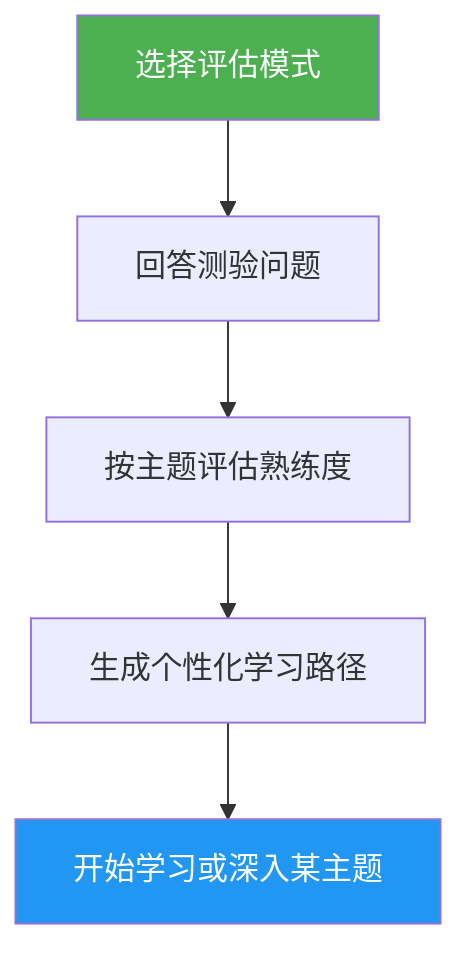

# Self-Assessment & Learning Path Advisor（自我评估与学习路径建议）

> 全面评估 Claude Code 熟练度的测验，覆盖 10 个功能领域，识别技能差距，并生成个性化的学习路径帮助你进阶。

## 亮点

- 两种评估模式：Quick（快速，8 题，2 分钟）和 Deep（深入，5 轮，5 分钟）
- 评估 10 个功能领域：Slash Commands、Memory、Skills、Hooks、MCP、Subagents、Checkpoints、Advanced Features、Plugins、CLI
- 按主题评分，划分掌握程度（无 / 基础 / 熟练）
- 结合依赖关系的差距分析与优先级排序
- 提供含具体练习与达标标准的个性化学习路径
- 后续操作：开始学习、深入某个主题、练习项目，或重新测验

## 何时使用

| 你可以这样说… | 技能会… |
|---|---|
| "assess my level" | 进行评估测验并判断你的水平 |
| "where should I start" | 评估你的经验并建议起点 |
| "check my skills" | 生成覆盖全部 10 个领域的详细技能画像 |
| "what should I learn next" | 识别差距并构建有优先级的学习路径 |

## 工作原理



## 评估模式

### Quick Assessment（快速评估，约 2 分钟）
- 2 轮共 8 道是/否经验问题
- 判定整体水平：入门 / 中级 / 高级
- 列出具体差距，并附上教程链接
- 适合：初次使用者、快速自查

### Deep Assessment（深入评估，约 5 分钟）
- 5 轮问题，覆盖 10 个功能领域（每轮 2 个主题）
- 按主题评分（每项 0-2 分，满分 20 分）
- 掌握度表格，列出强项领域、优先差距和需复习项
- 结合依赖关系的学习路径，分阶段并给出时间估算
- 推荐结合多个差距主题的练习项目
- 适合：想要进阶的资深用户、定期技能复查

## 用法

```
/self-assessment
```

## 输出内容

### 技能画像表格
展示每个主题的分数、掌握程度，以及状态（待学习 / 待复习 / 已掌握）。

### 个性化学习路径
- 按依赖顺序组织成若干阶段
- 每个主题包含：教程链接、重点内容、关键练习、达标标准
- 根据已掌握的主题调整时间估算
- 结合多个差距领域的练习项目

### 后续操作
呈现结果后，可以选择：
- 从第一个差距教程开始，进行有引导的练习
- 深入某个具体的差距领域
- 搭建一个覆盖你差距领域的练习项目
- 换一种评估模式重新测验
